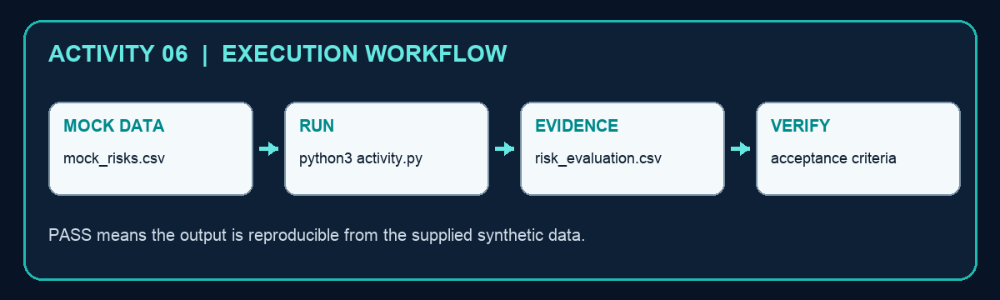
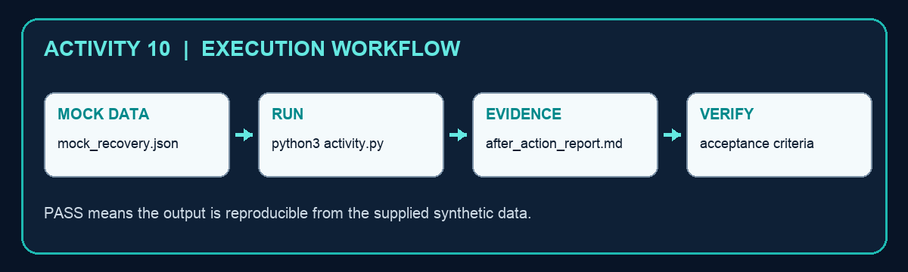

# Security Operations for Autonomous AI Agents — Learner Guide

**Course code:** TGS-2024042604  
**Version:** v1.0 · 12 September 2026  
**Provider:** Tertiary Infotech Academy Pte Ltd · UEN 201200696W

## Contents

1. Course information
2. Learning outcomes and criteria
3. Technical topics
4. Detailed hands-on activities
5. Assessment preparation
6. References

## 1. Course information

This 4-day, 32-hour WSQ course develops security strategy and security-operations capability for autonomous AI agents. It uses offline simulations, synthetic data and reproducible evidence artifacts.

## 2. Learning outcomes and criteria

- LO1: Formulate comprehensive security goals and establish business standards with an overarching security vision for autonomous AI agents.
- LO2: Communicate effective agent-security policies and practices, and manage compliance with best practices and technological advancements.
- LO3: Evaluate existing agent-security controls against business risks and costs, and develop strategies to resolve identified security gaps.
- LO4: Implement organisation-wide agent-security initiatives, assessing and addressing the impact of security gaps.

- **K1:** Goal setting and objectives of organisation security
- **K2:** Information security and assurance strategy
- **K3:** Best practices in information security policies
- **K4:** Best practices and emerging technologies in security control
- **K5:** Knowledge of security management benchmarks
- **K6:** Gap analysis in organisation security
- **K7:** Implications and impact of security gaps
- **A1:** Formulate security goals and objectives from business priorities, security vision, strategy directions and management benchmarks
- **A2:** Establish standards and practices that protect information integrity, authenticity and confidentiality
- **A3:** Manage compliance with information-security guidelines and classification or permission rules
- **A4:** Lead communication of security goals and objectives to the organisation
- **A5:** Review existing security controls against current and future business costs and risks
- **A6:** Develop strategies and plans to resolve security gaps
- **A7:** Drive organisation-wide security initiatives in line with internal and external standards

## Topic 01 — Security Strategy and Standards for Autonomous AI Agents

**Alignment:** LO1 · K1, K2, A1, A2  
**Slides:** 19–127

### Agent inventory

**Architecture and boundary.** registry → owner → runtime → tools → data stores.

**Concrete contract.** `agent_id, owner, purpose, model, tools[], data_classes[], status`

**Failure case.** Unregistered shadow agent reaches a production connector.

**Control.** Block deployment unless registry.status=approved and owner is active.

**Evidence and acceptance.** 100% of running agent_id values resolve to one current owner.

### Business impact mapping

**Architecture and boundary.** business service → agent task → dependent process → customer impact.

**Concrete contract.** `service_id, process_rto, data_rpo, maximum_loss_sgd, criticality`

**Failure case.** Agent outage exceeds the process recovery objective.

**Control.** Assign RTO/RPO and a manual fallback before production.

**Evidence and acceptance.** Observed recovery time ≤ approved RTO.

### Security objective hierarchy

**Architecture and boundary.** vision → business objective → security goal → control objective → metric.

**Concrete contract.** `objective_id, sponsor, target, threshold, due_date, evidence_source`

**Failure case.** A vague goal cannot be tested or owned.

**Control.** Write SMART control objectives with a named evidence source.

**Evidence and acceptance.** Every objective has one owner, threshold and review date.

### Data classification

**Architecture and boundary.** input sources → classifier → labelled context → tool output → retention.

**Concrete contract.** `data_class ∈ {public,internal,confidential,restricted}; purpose; retention_days`

**Failure case.** Restricted data is inserted into an unapproved prompt.

**Control.** Enforce label-aware routing, redaction and retention.

**Evidence and acceptance.** 0 restricted records leave an approved processing boundary.

### Trust-boundary map

**Architecture and boundary.** user zone → agent runtime → policy gateway → tool zone → external service.

**Concrete contract.** `boundary_id, source_zone, target_zone, protocol, authn, authz, encryption`

**Failure case.** A tool call crosses a boundary without an enforcement point.

**Control.** Place authentication, authorisation and logging at every crossing.

**Evidence and acceptance.** Each cross-zone flow maps to a tested control.

### Workload identity

**Architecture and boundary.** orchestrator → identity provider → short-lived token → resource.

**Concrete contract.** `subject=agent_id; audience=tool_id; ttl_seconds≤900; scopes[]`

**Failure case.** Several agents share one service-account credential.

**Control.** Issue a unique workload identity and scoped token per agent.

**Evidence and acceptance.** Token subject uniquely identifies the calling agent.

### Credential lifecycle

**Architecture and boundary.** vault → broker → ephemeral session → tool → revocation.

**Concrete contract.** `secret_ref, version, issued_at, expires_at, rotation_days, last_access`

**Failure case.** A credential appears in prompt context or source code.

**Control.** Use vault references and just-in-time retrieval outside model context.

**Evidence and acceptance.** Secret scan=0 and rotation age≤policy.

### Tool registry

**Architecture and boundary.** tool package → provenance check → capability record → approval → runtime.

**Concrete contract.** `tool_id, version, publisher, hash, capabilities[], risk_tier, approved`

**Failure case.** A renamed tool adds an undeclared destructive capability.

**Control.** Verify hash and capability manifest before registration.

**Evidence and acceptance.** Runtime hash equals approved registry hash.

### Tool allowlist

**Architecture and boundary.** planner proposal → policy decision → argument validation → tool execution.

**Concrete contract.** `agent_id, tool_id, action, resource, decision, policy_version`

**Failure case.** Model selects a valid but unauthorised administrative tool.

**Control.** Deny by default; match identity, action and resource.

**Evidence and acceptance.** Unauthorised test calls are denied and logged.

### Approval taxonomy

**Architecture and boundary.** action proposal → risk classifier → approver → signed decision → execution.

**Concrete contract.** `risk_tier, approval_required, approver_role, timeout_seconds, reason`

**Failure case.** High-impact action runs without human confirmation.

**Control.** Require signed, time-bound approval for irreversible actions.

**Evidence and acceptance.** 100% tier-3 executions carry a valid approval_id.

### Memory isolation

**Architecture and boundary.** session memory → tenant partition → encrypted store → retrieval filter.

**Concrete contract.** `tenant_id, session_id, namespace, classification, expires_at`

**Failure case.** One tenant retrieves another tenant's memory.

**Control.** Partition by tenant and session; filter before retrieval.

**Evidence and acceptance.** Cross-tenant retrieval test returns zero records.

### Session lifetime

**Architecture and boundary.** login → session token → agent loop → idle timer → termination.

**Concrete contract.** `session_id, created_at, last_active, max_age, idle_timeout, step_count`

**Failure case.** A forgotten session remains capable overnight.

**Control.** Cap age, idle time and maximum autonomous steps.

**Evidence and acceptance.** Expired sessions reject the next tool call.

### Egress control

**Architecture and boundary.** agent sandbox → DNS proxy → HTTP proxy → destination allowlist → internet.

**Concrete contract.** `destination, port, method, bytes_out, data_class, decision`

**Failure case.** Agent sends confidential content to an attacker domain.

**Control.** Deny unknown destinations and inspect outbound payload metadata.

**Evidence and acceptance.** Blocked egress increments alert and transfers zero bytes.

### Sandbox profile

**Architecture and boundary.** agent process → namespace → filesystem mount → network policy → resource quota.

**Concrete contract.** `image_digest, uid, readonly_root, cpu_limit, memory_mb, network_profile`

**Failure case.** Generated code writes outside its workspace or escapes to host.

**Control.** Run non-root with read-only root and restricted syscalls.

**Evidence and acceptance.** Escape tests fail; quota breach terminates only the sandbox.

### Artifact provenance

**Architecture and boundary.** source → signer → build → attestation → deployment verifier.

**Concrete contract.** `artifact_digest, source_commit, builder_id, signature, predicate_type`

**Failure case.** An unsigned prompt/tool bundle reaches production.

**Control.** Require signed provenance tied to source and builder.

**Evidence and acceptance.** Deploy verifier rejects missing or mismatched attestations.

### AI bill of materials

**Architecture and boundary.** model + prompt + tools + libraries + datasets + external APIs.

**Concrete contract.** `component, supplier, version, licence, hash, vulnerability_status`

**Failure case.** Vulnerable dependency or changed model is invisible.

**Control.** Maintain an AI BOM and rescan on every release.

**Evidence and acceptance.** All deployed components have versions and scan timestamps.

### Supplier assurance

**Architecture and boundary.** provider questionnaire → evidence review → contract controls → monitoring.

**Concrete contract.** `supplier_id, service, data_region, subprocessors[], SLA, exit_plan`

**Failure case.** External model provider changes retention or subprocessor terms.

**Control.** Contract for notification, data handling, logs and exit.

**Evidence and acceptance.** Quarterly review closes high-risk findings by due date.

### Risk appetite

**Architecture and boundary.** risk scenario → inherent score → appetite threshold → response decision.

**Concrete contract.** `likelihood_1_5, impact_1_5, inherent_score, appetite, treatment`

**Failure case.** Teams accept high residual risk without authority.

**Control.** Escalate residual_score>appetite to the risk owner.

**Evidence and acceptance.** No above-appetite risk lacks a signed treatment.

### Confidentiality objective

**Architecture and boundary.** sensitive source → authorised context → controlled output → recipient.

**Concrete contract.** `classification, authorised_purposes[], recipient, redactions[], leak_score`

**Failure case.** Agent paraphrases sensitive content into an allowed channel.

**Control.** Apply semantic DLP plus recipient and purpose checks.

**Evidence and acceptance.** Leak test score stays below the approved threshold.

### Integrity objective

**Architecture and boundary.** trusted instruction → planner → tool arguments → state change → verification.

**Concrete contract.** `request_hash, policy_hash, argument_hash, result_hash, actor`

**Failure case.** Prompt injection changes the intended transaction parameters.

**Control.** Bind approved intent to arguments and verify post-condition.

**Evidence and acceptance.** Approved and executed argument hashes match.

### Authenticity objective

**Architecture and boundary.** human or service → identity proof → signed instruction → agent.

**Concrete contract.** `issuer, subject, audience, issued_at, nonce, signature`

**Failure case.** Spoofed upstream service injects a privileged request.

**Control.** Verify issuer, audience, nonce and signature before planning.

**Evidence and acceptance.** Replay and wrong-audience tests are rejected.

### Availability objective

**Architecture and boundary.** request queue → agent workers → model endpoint → tools → fallback.

**Concrete contract.** `queue_depth, concurrency, timeout_ms, retry_budget, circuit_state`

**Failure case.** Retry storm exhausts model and tool quotas.

**Control.** Use bounded retries, bulkheads and circuit breakers.

**Evidence and acceptance.** Error budget and queue latency remain inside SLO.

### Auditability objective

**Architecture and boundary.** user request → agent decisions → tool calls → outputs → immutable log.

**Concrete contract.** `trace_id, parent_span, actor, action, resource, decision, timestamp`

**Failure case.** Incident team cannot reconstruct why a tool ran.

**Control.** Correlate decision and execution events under one trace_id.

**Evidence and acceptance.** Random sample replays reproduce the ordered action chain.

### Kill-switch baseline

**Architecture and boundary.** SOC command → control plane → token revoke → queue drain → agent stop.

**Concrete contract.** `agent_id, scope, initiated_by, reason, effective_at, confirmation`

**Failure case.** Agent continues acting after a critical alert.

**Control.** Implement tested global and per-agent stop paths.

**Evidence and acceptance.** P95 containment time meets the defined target.

## Topic 02 — Agent Security Policies, Governance and Compliance

**Alignment:** LO2 · K3, K4, A3, A4  
**Slides:** 128–233

### Policy hierarchy

**Architecture and boundary.** board principles → enterprise standard → agent policy → runtime rule.

**Concrete contract.** `policy_id, parent_id, scope, owner, version, effective_date`

**Failure case.** Runtime rules contradict enterprise requirements.

**Control.** Trace every executable rule to an approved parent policy.

**Evidence and acceptance.** No active rule has an orphaned parent_id.

### Policy-as-code

**Architecture and boundary.** repository → review → test → signed bundle → policy decision point.

**Concrete contract.** `rule_id, input_schema, effect, conditions[], tests[], bundle_hash`

**Failure case.** Manual configuration drifts from approved policy.

**Control.** Version, test and sign machine-enforced policy bundles.

**Evidence and acceptance.** Policy tests pass and deployed hash matches release.

### Governance RACI

**Architecture and boundary.** board → risk owner → product owner → security → operations → audit.

**Concrete contract.** `decision, accountable, responsible, consulted[], informed[]`

**Failure case.** Two teams assume the other owns a risky agent.

**Control.** Assign one accountable role per lifecycle decision.

**Evidence and acceptance.** Every critical decision has exactly one accountable owner.

### Information handling rules

**Architecture and boundary.** classification label → permitted model → permitted tools → output channel.

**Concrete contract.** `class, allowed_processors[], allowed_actions[], retention_days`

**Failure case.** Restricted records flow to a consumer-grade model endpoint.

**Control.** Enforce processor and channel restrictions by label.

**Evidence and acceptance.** Restricted-label policy tests deny unapproved processors.

### Permission recertification

**Architecture and boundary.** entitlement inventory → owner review → revoke/retain → evidence.

**Concrete contract.** `principal, permission, resource, last_used, reviewer, decision`

**Failure case.** Dormant high-privilege tool scopes remain active.

**Control.** Review high-risk permissions at least quarterly.

**Evidence and acceptance.** Unused privileged permissions are revoked within SLA.

### Control ownership

**Architecture and boundary.** control objective → control operator → evidence producer → risk owner.

**Concrete contract.** `control_id, operator, frequency, evidence, exception_route`

**Failure case.** A control exists on paper but nobody operates it.

**Control.** Bind control frequency and evidence to named roles.

**Evidence and acceptance.** Missed control runs create owner alerts.

### Evidence retention

**Architecture and boundary.** event source → normaliser → immutable store → legal hold → disposal.

**Concrete contract.** `record_type, retention_days, legal_hold, hash, disposal_date`

**Failure case.** Evidence is deleted before an investigation or kept indefinitely.

**Control.** Apply record-specific retention and defensible disposal.

**Evidence and acceptance.** Retention and disposal jobs produce signed reports.

### Audit event schema

**Architecture and boundary.** agent runtime + gateway + tools → normaliser → evidence lake.

**Concrete contract.** `event_time, trace_id, agent_id, tool_id, action, decision, outcome`

**Failure case.** Logs cannot be joined across components.

**Control.** Adopt required correlation and identity fields.

**Evidence and acceptance.** Schema conformance ≥99.5% for critical events.

### Privacy minimisation

**Architecture and boundary.** data source → field allowlist → redaction → model context → output.

**Concrete contract.** `field, purpose, necessity, transformation, retention`

**Failure case.** Entire customer record is sent for a narrow task.

**Control.** Minimise to purpose-required fields before context assembly.

**Evidence and acceptance.** Approved field allowlist matches observed prompt fields.

### Purpose limitation

**Architecture and boundary.** request purpose → authorised use → tool access → evidence.

**Concrete contract.** `purpose_id, lawful_basis, allowed_data[], allowed_actions[], expiry`

**Failure case.** Agent reuses data for an unrelated task.

**Control.** Bind data and tool permissions to a declared purpose.

**Evidence and acceptance.** Mismatched purpose_id causes a deny decision.

### Change management

**Architecture and boundary.** change request → impact analysis → approval → canary → rollback.

**Concrete contract.** `change_id, components[], risk, tests[], approver, rollback_ref`

**Failure case.** Prompt or tool change silently expands agency.

**Control.** Treat prompts, policies and tools as controlled changes.

**Evidence and acceptance.** Every production diff maps to a change_id and test run.

### Release gate

**Architecture and boundary.** source commit → tests → red-team suite → policy checks → deploy.

**Concrete contract.** `commit, test_pass_rate, critical_failures, signer, release_decision`

**Failure case.** Known prompt-injection failure ships to production.

**Control.** Block on critical failures or missing evidence.

**Evidence and acceptance.** Gate records show zero waived critical failures.

### Red-team acceptance

**Architecture and boundary.** attack catalogue → test harness → agent under test → findings → fix.

**Concrete contract.** `test_id, attack_class, expected_control, observed_result, severity`

**Failure case.** Security claims are not challenged with adversarial inputs.

**Control.** Maintain regression tests for direct and indirect injection.

**Evidence and acceptance.** Critical attack success rate equals zero at release.

### Third-party service level

**Architecture and boundary.** agent → external service → monitoring → escalation → exit.

**Concrete contract.** `availability_slo, log_access_sla, breach_notice_hours, RTO, export_format`

**Failure case.** Provider outage or breach cannot be investigated.

**Control.** Contract measurable security and exit obligations.

**Evidence and acceptance.** Provider evidence meets each contracted SLA.

### Incident notification

**Architecture and boundary.** detection → privacy/security triage → decision clock → notification.

**Concrete contract.** `incident_id, discovered_at, jurisdictions[], impact, deadline, owner`

**Failure case.** Notification deadline is missed because ownership is unclear.

**Control.** Start jurisdiction-specific clocks at verified discovery.

**Evidence and acceptance.** Decision and notification timestamps are auditable.

### Exception workflow

**Architecture and boundary.** control failure → exception request → compensating control → expiry.

**Concrete contract.** `exception_id, control_id, rationale, risk_owner, expiry, compensation`

**Failure case.** Temporary bypass becomes permanent shadow policy.

**Control.** Time-box exceptions and auto-disable at expiry.

**Evidence and acceptance.** Zero active exceptions are past expiry.

### Framework crosswalk

**Architecture and boundary.** requirement → control objective → implementation → evidence.

**Concrete contract.** `framework, clause, control_id, evidence_id, coverage_status`

**Failure case.** Multiple audits ask for duplicate evidence with inconsistent answers.

**Control.** Maintain one control-to-framework crosswalk.

**Evidence and acceptance.** Each applicable clause has current evidence or a gap.

### NIST AI RMF operations

**Architecture and boundary.** GOVERN → MAP → MEASURE → MANAGE → monitoring feedback.

**Concrete contract.** `function, category, risk_scenario, metric, response, owner`

**Failure case.** AI risk process stops at documentation.

**Control.** Connect RMF outcomes to runtime controls and metrics.

**Evidence and acceptance.** Managed risks show evidence from production monitoring.

### ISO 27001 integration

**Architecture and boundary.** ISMS context → risk treatment → Annex A controls → evidence.

**Concrete contract.** `asset, risk_id, control_ref, statement_of_applicability, evidence`

**Failure case.** Agent systems sit outside the established ISMS.

**Control.** Add agent assets and treatments to the existing ISMS.

**Evidence and acceptance.** Agent risks appear in SoA and internal-audit sampling.

### Secure development lifecycle

**Architecture and boundary.** design threat model → code/prompt review → test → deploy → monitor.

**Concrete contract.** `artifact_type, reviewer, tests, vulnerabilities, approval`

**Failure case.** Prompt/config changes bypass application security review.

**Control.** Apply secure SDLC controls to all agent artifacts.

**Evidence and acceptance.** No production artifact lacks review and test evidence.

### Model/version governance

**Architecture and boundary.** approved model catalogue → evaluation → pinning → monitoring.

**Concrete contract.** `provider, model_id, version, eval_set, score, retirement_date`

**Failure case.** Provider model update changes behaviour unexpectedly.

**Control.** Pin versions where possible and re-evaluate changes.

**Evidence and acceptance.** Behavioural regression stays within tolerance.

### Security communication cadence

**Architecture and boundary.** control owners → operational review → risk committee → board.

**Concrete contract.** `audience, frequency, metrics[], decisions[], action_owner`

**Failure case.** Technical alerts never become business decisions.

**Control.** Tailor evidence and decisions to each governance layer.

**Evidence and acceptance.** Actions have owners and due dates after every review.

### Assurance dashboard

**Architecture and boundary.** telemetry + tests + exceptions + incidents → governed metrics.

**Concrete contract.** `metric_id, numerator, denominator, threshold, trend, owner`

**Failure case.** Vanity metrics hide deteriorating controls.

**Control.** Use decision-linked leading and lagging indicators.

**Evidence and acceptance.** Threshold breach triggers a documented action.

### Training and tabletop

**Architecture and boundary.** role profile → scenario → injects → decisions → after-action plan.

**Concrete contract.** `exercise_id, roles[], inject_time, decision, gap, due_date`

**Failure case.** Teams know policy but cannot execute containment.

**Control.** Rehearse prompt injection and tool abuse quarterly.

**Evidence and acceptance.** Closure rate and containment time improve across exercises.

## Topic 03 — AI Agent Risk Assessment and Security Control Evaluation

**Alignment:** LO3 · K5, K6, A5, A6  
**Slides:** 234–339

### Agent threat model

**Architecture and boundary.** assets → trust boundaries → attacker goals → abuse paths → controls.

**Concrete contract.** `asset, entry_point, precondition, technique, impact, mitigation`

**Failure case.** Threat model treats the LLM as the only attack surface.

**Control.** Model runtime, tools, memory, identity and suppliers.

**Evidence and acceptance.** Every high-value asset has at least one tested abuse path.

### Direct prompt injection

**Architecture and boundary.** user input → context → planner → prohibited tool proposal.

**Concrete contract.** `input_source=user; injection_score; target_instruction; decision`

**Failure case.** User instruction overrides policy and triggers a sensitive action.

**Control.** Separate policy from content and enforce action authorisation.

**Evidence and acceptance.** Injection suite cannot produce an unauthorised tool call.

### Indirect prompt injection

**Architecture and boundary.** document/web page → retriever → context → planner → tool.

**Concrete contract.** `source_uri, trust_label, content_hash, instruction_markers, action`

**Failure case.** Retrieved content tells the agent to exfiltrate data.

**Control.** Label untrusted context and prevent it from granting authority.

**Evidence and acceptance.** Untrusted-context test is contained and logged.

### Tool poisoning

**Architecture and boundary.** tool metadata → planner selection → malicious output → next action.

**Concrete contract.** `tool_id, description_hash, publisher, output_trust, version`

**Failure case.** Poisoned tool description manipulates planning.

**Control.** Pin signed metadata and constrain tool output as untrusted.

**Evidence and acceptance.** Metadata hash mismatch blocks registration.

### Context poisoning

**Architecture and boundary.** system prompt + developer prompt + memory + retrieval + user input.

**Concrete contract.** `segment_type, source, precedence, integrity_hash, trust_level`

**Failure case.** Low-trust context persists as high-trust instruction.

**Control.** Tag provenance and enforce precedence outside the model.

**Evidence and acceptance.** Context assembly report shows trust labels and hashes.

### Memory poisoning

**Architecture and boundary.** conversation → memory write policy → vector store → later retrieval.

**Concrete contract.** `memory_id, author, tenant, confidence, ttl, approved_for_reuse`

**Failure case.** Adversarial fact persists and steers future sessions.

**Control.** Validate writes, isolate tenants and expire low-confidence memory.

**Evidence and acceptance.** Poison seed is absent from unrelated session retrieval.

### Data exfiltration

**Architecture and boundary.** sensitive store → agent context → transformation → outbound tool.

**Concrete contract.** `data_class, bytes_read, destination, bytes_out, leak_score`

**Failure case.** Agent encodes restricted data to evade keyword DLP.

**Control.** Use semantic DLP, egress policy and purpose binding.

**Evidence and acceptance.** Red-team exfil attempts transfer zero restricted bytes.

### Credential harvesting

**Architecture and boundary.** prompt/tool output → context → secret lookup → outbound channel.

**Concrete contract.** `secret_ref, access_reason, requester, destination, decision`

**Failure case.** Agent is tricked into retrieving and revealing a token.

**Control.** Broker secrets only to tools; never return them to the model.

**Evidence and acceptance.** Model-visible trace contains no secret material.

### Excessive agency

**Architecture and boundary.** broad goal → planner → long action chain → irreversible side effect.

**Concrete contract.** `max_steps, allowed_tools, spend_limit, approval_tier, stop_reason`

**Failure case.** Agent performs destructive actions beyond user intent.

**Control.** Bound steps, scope, spend and irreversible actions.

**Evidence and acceptance.** Action-chain tests stop at configured bounds.

### Privilege escalation

**Architecture and boundary.** low-privilege agent → mis-scoped role → admin API → state change.

**Concrete contract.** `principal, role, scope, resource, requested_action, decision`

**Failure case.** Wildcard permission makes admin action reachable.

**Control.** Eliminate wildcard scopes and validate resource ownership.

**Evidence and acceptance.** Privilege-path graph has no unintended route.

### Compromised integration

**Architecture and boundary.** agent → SaaS connector → compromised account/API → poisoned result.

**Concrete contract.** `connector_id, auth_subject, endpoint, tls_peer, response_hash`

**Failure case.** Trusted integration returns malicious instructions or data.

**Control.** Treat external output as untrusted and monitor connector identity.

**Evidence and acceptance.** Connector anomaly triggers quarantine.

### Supply-chain compromise

**Architecture and boundary.** library/model/tool image → build → registry → runtime.

**Concrete contract.** `package, version, digest, signer, SBOM_ref, vuln_status`

**Failure case.** Typosquatted dependency executes inside the agent runtime.

**Control.** Pin hashes, verify signatures and scan the AI BOM.

**Evidence and acceptance.** Unapproved digest cannot pass deployment gate.

### Unbounded consumption

**Architecture and boundary.** request → recursive planning → model/tool calls → billing.

**Concrete contract.** `call_count, token_count, elapsed_ms, cost_sgd, budget_sgd`

**Failure case.** Loop consumes quota and creates unexpected cost.

**Control.** Enforce budgets, loop detection and per-session quotas.

**Evidence and acceptance.** Session stops before cost_sgd exceeds budget_sgd.

### Service denial

**Architecture and boundary.** traffic source → queue → agent worker → model/tool dependencies.

**Concrete contract.** `request_rate, queue_depth, timeout_rate, dependency_health`

**Failure case.** Prompt flood saturates limited agent workers.

**Control.** Rate-limit, queue fairly and isolate critical workloads.

**Evidence and acceptance.** Critical queue latency remains within SLO under load.

### Hallucinated action

**Architecture and boundary.** ambiguous request → fabricated resource → tool call → failure/impact.

**Concrete contract.** `resource_id, source_of_truth, confidence, validation_result`

**Failure case.** Agent invents an account and changes the wrong record.

**Control.** Resolve and validate identifiers against authoritative data.

**Evidence and acceptance.** Unknown resource_id is denied before execution.

### Insecure output handling

**Architecture and boundary.** model output → parser → downstream interpreter/browser/SQL.

**Concrete contract.** `output_type, schema_valid, encoding, destination, sanitised`

**Failure case.** Generated command or markup executes as code.

**Control.** Use structured schemas, escaping and non-executable rendering.

**Evidence and acceptance.** Fuzz outputs cannot cross the interpreter boundary.

### Sandbox escape

**Architecture and boundary.** generated code → container syscall → host kernel → adjacent workload.

**Concrete contract.** `syscall, seccomp_action, uid, mount, network_namespace`

**Failure case.** Agent workload accesses host socket or filesystem.

**Control.** Harden isolation and block sensitive mounts/syscalls.

**Evidence and acceptance.** Escape test is blocked and produces a high-severity event.

### Human override failure

**Architecture and boundary.** agent proposal → reviewer UI → context → decision → execution.

**Concrete contract.** `approval_id, action_summary, risk, evidence, reviewer, decision`

**Failure case.** Reviewer rubber-stamps an opaque or misleading proposal.

**Control.** Show exact diff, impact and evidence; support reject and edit.

**Evidence and acceptance.** Review sampling finds complete decision context.

### Likelihood-impact scoring

**Architecture and boundary.** scenario evidence → likelihood → impact dimensions → inherent score.

**Concrete contract.** `likelihood_1_5, financial, operational, legal, safety, score`

**Failure case.** Teams compare risks using inconsistent scales.

**Control.** Define anchored scales and take the highest material impact.

**Evidence and acceptance.** Independent scorers remain within one rating level.

### Expected-loss estimate

**Architecture and boundary.** event frequency × loss magnitude → annualised loss.

**Concrete contract.** `frequency_per_year, loss_sgd, expected_loss_sgd, confidence`

**Failure case.** Control spend is justified only by qualitative fear.

**Control.** Use transparent ranges and sensitivity analysis.

**Evidence and acceptance.** expected_loss = frequency × loss; assumptions are documented.

### Control effectiveness

**Architecture and boundary.** designed control → operating test → coverage → effectiveness.

**Concrete contract.** `design_score, operation_score, coverage_pct, effectiveness_pct`

**Failure case.** Control exists but operates on only part of the fleet.

**Control.** Test design, operation and coverage separately.

**Evidence and acceptance.** effective coverage meets the risk-treatment target.

### Residual risk

**Architecture and boundary.** inherent risk × (1 − control effectiveness) → residual decision.

**Concrete contract.** `inherent_score, effectiveness_pct, residual_score, appetite`

**Failure case.** Reported risk ignores control failure or coverage gaps.

**Control.** Calculate residual risk with tested effectiveness.

**Evidence and acceptance.** Above-appetite residual risk is escalated.

### Gap register

**Architecture and boundary.** benchmark/control objective → current state → gap → owner → due date.

**Concrete contract.** `gap_id, requirement, evidence, severity, owner, target_date`

**Failure case.** Findings lack an actionable path to closure.

**Control.** Record evidence, severity, owner, dependency and acceptance test.

**Evidence and acceptance.** No high gap is ownerless or overdue without escalation.

### Remediation portfolio

**Architecture and boundary.** gaps → options → cost/risk reduction → priority → roadmap.

**Concrete contract.** `option, cost_sgd, effort_days, risk_reduction, dependency, priority`

**Failure case.** Teams fund visible controls instead of highest value.

**Control.** Prioritise by risk reduction, feasibility and dependencies.

**Evidence and acceptance.** Selected portfolio fits budget and maximises risk reduction.

## Topic 04 — Implementing and Monitoring Organisation-Wide Agent Security Operations

**Alignment:** LO4 · K7, A7  
**Slides:** 340–448

### Telemetry contract

**Architecture and boundary.** runtime → policy gateway → tools → collector → SIEM.

**Concrete contract.** `event_time, trace_id, span_id, agent_id, session_id, event_type`

**Failure case.** Missing fields break investigations and detections.

**Control.** Require schema validation at ingestion.

**Evidence and acceptance.** Critical-event schema conformance ≥99.5%.

### Trace correlation

**Architecture and boundary.** user request → plan spans → tool spans → approval span → outcome.

**Concrete contract.** `trace_id, parent_span_id, actor, action, resource, status`

**Failure case.** Events exist but cannot be ordered into one incident.

**Control.** Propagate trace context across every component.

**Evidence and acceptance.** A sampled session reconstructs without orphan spans.

### Immutable audit log

**Architecture and boundary.** event producer → signed envelope → append-only store → verifier.

**Concrete contract.** `sequence, previous_hash, event_hash, signer, timestamp`

**Failure case.** Attacker deletes or edits incriminating tool events.

**Control.** Use append-only storage and hash chaining.

**Evidence and acceptance.** Verification detects any missing or altered record.

### Detection rule lifecycle

**Architecture and boundary.** hypothesis → query → test data → deployment → tuning.

**Concrete contract.** `rule_id, version, query, severity, threshold, owner, status`

**Failure case.** Unreviewed rule floods analysts or misses known attacks.

**Control.** Version rules with tests, owners and tuning history.

**Evidence and acceptance.** Test fixtures yield expected alerts with bounded noise.

### Behaviour anomaly score

**Architecture and boundary.** feature window → baseline → deviation → score → alert.

**Concrete contract.** `tool_rate_z, new_destination, denied_ratio, step_count, score`

**Failure case.** Compromised agent stays within simple static limits.

**Control.** Combine identity-specific behavioural features.

**Evidence and acceptance.** score≥0.80 opens an investigation in mock policy.

### Prompt-injection signals

**Architecture and boundary.** input/context → detector ensemble → policy gate → trace.

**Concrete contract.** `instruction_density, trust_mismatch, secret_request, override_phrase`

**Failure case.** Obfuscated injection bypasses one keyword filter.

**Control.** Layer provenance, classifiers and action authorisation.

**Evidence and acceptance.** High-risk signal plus sensitive action is blocked.

### Tool-sequence graph

**Architecture and boundary.** tool events → directed graph → rare edge model → alert.

**Concrete contract.** `from_tool, to_tool, edge_count, baseline_prob, risk_weight`

**Failure case.** Each call is allowed but the sequence is malicious.

**Control.** Detect unusual action chains and privileged transitions.

**Evidence and acceptance.** Rare high-risk edge produces a correlated alert.

### Data-egress detection

**Architecture and boundary.** read events + classification + outbound events → correlation.

**Concrete contract.** `bytes_read, data_class, destination, bytes_out, time_delta`

**Failure case.** Agent reads restricted data then sends a small encoded payload.

**Control.** Correlate sensitive reads with outbound channels.

**Evidence and acceptance.** Restricted-read + unknown-egress within 5 min alerts.

### Secret-access anomaly

**Architecture and boundary.** vault access → purpose → tool call → destination.

**Concrete contract.** `secret_ref, agent_id, tool_id, reason, usual_for_agent, result`

**Failure case.** Agent requests a secret unrelated to its normal tools.

**Control.** Baseline secret-to-tool relationships and deny mismatches.

**Evidence and acceptance.** Unexpected secret_ref/tool_id pair is denied.

### Session drift

**Architecture and boundary.** session features over time → baseline comparison → drift signal.

**Concrete contract.** `goal_hash, active_tools[], destinations[], step_count, drift_score`

**Failure case.** Long session gradually moves away from approved goal.

**Control.** Re-authorise when goal or capability footprint changes.

**Evidence and acceptance.** drift_score≥0.70 pauses before the next action.

### Rate-limit control

**Architecture and boundary.** identity bucket + tool bucket + destination bucket → decision.

**Concrete contract.** `window_seconds, max_requests, current_count, retry_after`

**Failure case.** Distributed calls evade a single global counter.

**Control.** Limit by agent, tenant, tool and destination.

**Evidence and acceptance.** Load test produces 429/deny at configured thresholds.

### Budget alert

**Architecture and boundary.** token/tool usage → cost estimator → threshold → circuit breaker.

**Concrete contract.** `session_cost, daily_cost, warning_pct, hard_limit, action`

**Failure case.** Runaway planning consumes budget without operational alert.

**Control.** Warn at 70%, throttle at 90%, stop at 100% in mock policy.

**Evidence and acceptance.** Budget breach stops new calls and preserves trace.

### Allowlist denial

**Architecture and boundary.** tool proposal → policy lookup → deny → audit → user-safe response.

**Concrete contract.** `agent_id, tool_id, action, policy_version, deny_reason`

**Failure case.** Blocked action fails silently and attacker keeps probing.

**Control.** Log denials with reason codes and correlate repetition.

**Evidence and acceptance.** Repeated deny_reason creates one deduplicated alert.

### Approval timeout

**Architecture and boundary.** proposal → approver queue → timer → expire → no execution.

**Concrete contract.** `approval_id, created_at, expires_at, reviewer, status`

**Failure case.** Old approval is replayed after context changes.

**Control.** Bind approval to action hash and expiry.

**Evidence and acceptance.** Expired or mismatched approval_id is rejected.

### Alert triage

**Architecture and boundary.** alert → enrichment → scope → confidence → disposition.

**Concrete contract.** `alert_id, evidence[], affected_agents[], severity, confidence, owner`

**Failure case.** Analyst closes alert without inspecting action chain.

**Control.** Require minimum enrichment and trace evidence.

**Evidence and acceptance.** Disposition record cites the trace and decision rationale.

### Incident severity

**Architecture and boundary.** impact + scope + data class + autonomy + persistence → severity.

**Concrete contract.** `agents_affected, data_class, external_effect, persistence, sev`

**Failure case.** Agent incident is ranked like a low-impact chatbot error.

**Control.** Account for real-world actions and ongoing autonomy.

**Evidence and acceptance.** SEV-1 criteria trigger executive and containment paths.

### Containment circuit breaker

**Architecture and boundary.** SOC decision → gateway deny-all → queue drain → confirmation.

**Concrete contract.** `incident_id, scope, initiated_by, effective_at, agents_stopped`

**Failure case.** Containment request succeeds in UI but actions continue.

**Control.** Verify control-plane and data-plane stop states.

**Evidence and acceptance.** No tool event occurs after effective_at.

### Token revocation

**Architecture and boundary.** incident → identity provider → revoke session/tokens → resource deny.

**Concrete contract.** `token_id, subject, audience, revoked_at, reason`

**Failure case.** Disabled agent reuses an already-issued token.

**Control.** Revoke tokens and enforce short TTL at resources.

**Evidence and acceptance.** Post-revocation access attempt returns deny.

### Agent disablement

**Architecture and boundary.** registry status → scheduler → runtime → tool gateway.

**Concrete contract.** `agent_id, status=disabled, version, reason, changed_by`

**Failure case.** New worker starts after the incident.

**Control.** Make scheduler and gateway consume authoritative status.

**Evidence and acceptance.** Disabled agent cannot start or call tools.

### Evidence preservation

**Architecture and boundary.** volatile session → snapshot → immutable store → chain of custody.

**Concrete contract.** `evidence_id, source, collected_at, hash, collector, location`

**Failure case.** Investigation changes or loses ephemeral context.

**Control.** Snapshot prompts, memory, policies, logs and tool outputs.

**Evidence and acceptance.** Stored hash matches acquisition hash.

### Session replay

**Architecture and boundary.** ordered events + versions + mock tools → deterministic replay.

**Concrete contract.** `trace_id, model_version, prompt_hash, tool_fixtures, outcome_diff`

**Failure case.** Team cannot reproduce the malicious decision path.

**Control.** Replay with fixed artifacts and recorded tool outputs.

**Evidence and acceptance.** Replay identifies the first policy divergence.

### Eradication

**Architecture and boundary.** root cause → prompt/policy/tool fix → regression tests → redeploy.

**Concrete contract.** `root_cause, changed_artifacts[], tests[], approver, release_id`

**Failure case.** Agent returns with the same vulnerable configuration.

**Control.** Tie eradication to tested artifact changes.

**Evidence and acceptance.** Original attack fixture fails after the fix.

### Recovery

**Architecture and boundary.** clean release → staged enablement → monitoring → normal service.

**Concrete contract.** `release_id, canary_pct, health_metrics[], rollback_threshold`

**Failure case.** Full fleet resumes before controls are proven.

**Control.** Recover through canary stages with rollback thresholds.

**Evidence and acceptance.** Canary stays healthy for the defined observation window.

### Lessons and metrics

**Architecture and boundary.** incident timeline → control gaps → actions → verification → trend.

**Concrete contract.** `lesson_id, control_gap, action_owner, due_date, validation, metric`

**Failure case.** Post-incident actions close administratively but not technically.

**Control.** Require evidence-based closure and recurrence metrics.

**Evidence and acceptance.** Action is closed only after the acceptance test passes.

## 4. Detailed hands-on activities

### Activity 01 — Build an Agent Inventory and Security Objectives

**Goal:** Build an Agent Inventory and Security Objectives and preserve reproducible evidence for assessor review.

**Criteria:** A1  
**Folder:** `labs/activity-01-agent-inventory`  
**Input:** `mock_agents.json`  
**Script:** `activity.py`  
**Evidence output:** `agent_security_baseline.md`

**Workflow:** `mock_agents.json` → validate → evaluate controls → generate `agent_security_baseline.md` → verify acceptance criteria


#### Detailed procedure

1. Open mock_agents.json and identify the missing governance fields.
2. Run python3 activity.py.
3. Open agent_security_baseline.md and compare risk tiers with tools and data classes.
4. Define a measurable objective for each active agent.
5. Flag any unowned or experimental active agent for treatment.

Run:

```bash
cd labs/activity-01-agent-inventory
python3 activity.py
```

> **Test it:** Change one safe mock-data value, rerun the script, and explain the resulting evidence change. Restore the original mock data afterwards.

**Verify:** All active agents have an owner, purpose, data class, risk tier and measurable security objective.

**Troubleshooting:** If the input cannot be found, run from the activity folder. If parsing fails, restore the original mock-data syntax. If the decision is unexpected, compare the input value with the rule in `activity.py`. Delete only `agent_security_baseline.md` to clean up; retain the script and mock data.

### Activity 02 — Threat-Model Agent Trust Boundaries

**Goal:** Threat-Model Agent Trust Boundaries and preserve reproducible evidence for assessor review.

**Criteria:** A1  
**Folder:** `labs/activity-02-trust-boundary-threat-model`  
**Input:** `mock_dataflows.json`  
**Script:** `activity.py`  
**Evidence output:** `threat_model.json`

**Workflow:** `mock_dataflows.json` → validate → evaluate controls → generate `threat_model.json` → verify acceptance criteria


#### Detailed procedure

1. Review the five trust zones and each flow in mock_dataflows.json.
2. Run python3 activity.py.
3. Inspect missing_controls and risk_score in threat_model.json.
4. Add a control to one weak boundary and rerun.
5. Confirm every accepted flow has authentication, authorisation, encryption and logging.

Run:

```bash
cd labs/activity-02-trust-boundary-threat-model
python3 activity.py
```

> **Test it:** Change one safe mock-data value, rerun the script, and explain the resulting evidence change. Restore the original mock data afterwards.

**Verify:** Every cross-zone flow has authentication, authorisation, encryption and logging controls.

**Troubleshooting:** If the input cannot be found, run from the activity folder. If parsing fails, restore the original mock-data syntax. If the decision is unexpected, compare the input value with the rule in `activity.py`. Delete only `threat_model.json` to clean up; retain the script and mock data.

### Activity 03 — Enforce Tool and Data Guardrails

**Goal:** Enforce Tool and Data Guardrails and preserve reproducible evidence for assessor review.

**Criteria:** A2, A3  
**Folder:** `labs/activity-03-policy-as-code`  
**Input:** `mock_requests.json`  
**Script:** `activity.py`  
**Evidence output:** `policy_decisions.csv`

**Workflow:** `mock_requests.json` → validate → evaluate controls → generate `policy_decisions.csv` → verify acceptance criteria


#### Detailed procedure

1. Inspect the mock requests and identify tool, data, egress and approval risks.
2. Run python3 activity.py.
3. Open policy_decisions.csv and trace each deny reason to a policy condition.
4. Create one additional unauthorised request and rerun.
5. Verify deny-by-default behavior and auditable reason codes.

Run:

```bash
cd labs/activity-03-policy-as-code
python3 activity.py
```

> **Test it:** Change one safe mock-data value, rerun the script, and explain the resulting evidence change. Restore the original mock data afterwards.

**Verify:** Allowed requests execute; restricted data, unlisted tools and missing approvals are denied with reasons.

**Troubleshooting:** If the input cannot be found, run from the activity folder. If parsing fails, restore the original mock-data syntax. If the decision is unexpected, compare the input value with the rule in `activity.py`. Delete only `policy_decisions.csv` to clean up; retain the script and mock data.

### Activity 04 — Assemble a Compliance Evidence Pack

**Goal:** Assemble a Compliance Evidence Pack and preserve reproducible evidence for assessor review.

**Criteria:** A3  
**Folder:** `labs/activity-04-compliance-evidence`  
**Input:** `mock_evidence.json`  
**Script:** `activity.py`  
**Evidence output:** `compliance_report.md`

**Workflow:** `mock_evidence.json` → validate → evaluate controls → generate `compliance_report.md` → verify acceptance criteria


#### Detailed procedure

1. Read the requirements and evidence ages in mock_evidence.json.
2. Run python3 activity.py.
3. Open compliance_report.md and locate missing or stale evidence.
4. Assign a remediation owner and evidence due date.
5. Explain why a passing but stale artifact does not prove current operation.

Run:

```bash
cd labs/activity-04-compliance-evidence
python3 activity.py
```

> **Test it:** Change one safe mock-data value, rerun the script, and explain the resulting evidence change. Restore the original mock data afterwards.

**Verify:** Each required control maps to current evidence, an owner and a status; gaps are explicit.

**Troubleshooting:** If the input cannot be found, run from the activity folder. If parsing fails, restore the original mock-data syntax. If the decision is unexpected, compare the input value with the rule in `activity.py`. Delete only `compliance_report.md` to clean up; retain the script and mock data.

### Activity 05 — Communicate Agent Security Posture

**Goal:** Communicate Agent Security Posture and preserve reproducible evidence for assessor review.

**Criteria:** A4  
**Folder:** `labs/activity-05-security-communication`  
**Input:** `mock_metrics.csv`  
**Script:** `activity.py`  
**Evidence output:** `security_brief.html`

**Workflow:** `mock_metrics.csv` → validate → evaluate controls → generate `security_brief.html` → verify acceptance criteria


#### Detailed procedure

1. Review the mock metrics, thresholds, audiences and owners.
2. Run python3 activity.py.
3. Open security_brief.html in a browser.
4. Separate the technical response from the risk-committee decision.
5. Write one action, owner and due date for every threshold breach.

Run:

```bash
cd labs/activity-05-security-communication
python3 activity.py
```

> **Test it:** Change one safe mock-data value, rerun the script, and explain the resulting evidence change. Restore the original mock data afterwards.

**Verify:** The generated brief shows thresholds, current values, decisions, owners and due dates for two audiences.

**Troubleshooting:** If the input cannot be found, run from the activity folder. If parsing fails, restore the original mock-data syntax. If the decision is unexpected, compare the input value with the rule in `activity.py`. Delete only `security_brief.html` to clean up; retain the script and mock data.

### Activity 06 — Quantify Agent Risks and Control Value

**Goal:** Quantify Agent Risks and Control Value and preserve reproducible evidence for assessor review.

**Criteria:** A5  
**Folder:** `labs/activity-06-risk-control-evaluation`  
**Input:** `mock_risks.csv`  
**Script:** `activity.py`  
**Evidence output:** `risk_evaluation.csv`

**Workflow:** `mock_risks.csv` → validate → evaluate controls → generate `risk_evaluation.csv` → verify acceptance criteria



#### Detailed procedure

1. Inspect frequency, loss magnitude, effectiveness and appetite assumptions.
2. Run python3 activity.py.
3. Recalculate inherent and residual expected loss for one row.
4. Change one effectiveness value and rerun the sensitivity check.
5. Confirm the treatment decision is based on residual loss versus appetite.

Run:

```bash
cd labs/activity-06-risk-control-evaluation
python3 activity.py
```

> **Test it:** Change one safe mock-data value, rerun the script, and explain the resulting evidence change. Restore the original mock data afterwards.

**Verify:** Residual risk and expected annual loss calculations reconcile with the input assumptions.

**Troubleshooting:** If the input cannot be found, run from the activity folder. If parsing fails, restore the original mock-data syntax. If the decision is unexpected, compare the input value with the rule in `activity.py`. Delete only `risk_evaluation.csv` to clean up; retain the script and mock data.

### Activity 07 — Prioritise a Security Gap Remediation Roadmap

**Goal:** Prioritise a Security Gap Remediation Roadmap and preserve reproducible evidence for assessor review.

**Criteria:** A6  
**Folder:** `labs/activity-07-gap-remediation`  
**Input:** `mock_gaps.csv`  
**Script:** `activity.py`  
**Evidence output:** `remediation_roadmap.md`

**Workflow:** `mock_gaps.csv` → validate → evaluate controls → generate `remediation_roadmap.md` → verify acceptance criteria


#### Detailed procedure

1. Review severity, risk reduction, cost, effort and dependency fields.
2. Run python3 activity.py.
3. Open remediation_roadmap.md and validate the SGD 40,000 constraint.
4. Challenge one ranking using feasibility or dependency evidence.
5. Define an acceptance test before considering a gap closed.

Run:

```bash
cd labs/activity-07-gap-remediation
python3 activity.py
```

> **Test it:** Change one safe mock-data value, rerun the script, and explain the resulting evidence change. Restore the original mock data afterwards.

**Verify:** The roadmap stays within the mock budget and prioritises overdue and above-appetite gaps.

**Troubleshooting:** If the input cannot be found, run from the activity folder. If parsing fails, restore the original mock-data syntax. If the decision is unexpected, compare the input value with the rule in `activity.py`. Delete only `remediation_roadmap.md` to clean up; retain the script and mock data.

### Activity 08 — Detect Suspicious Agent Behaviour

**Goal:** Detect Suspicious Agent Behaviour and preserve reproducible evidence for assessor review.

**Criteria:** A7  
**Folder:** `labs/activity-08-agent-detection`  
**Input:** `mock_events.jsonl`  
**Script:** `activity.py`  
**Evidence output:** `detections.json`

**Workflow:** `mock_events.jsonl` → validate → evaluate controls → generate `detections.json` → verify acceptance criteria


#### Detailed procedure

1. Inspect the JSONL event sequence by trace_id.
2. Run python3 activity.py.
3. Open detections.json and explain every correlated signal.
4. Add a benign event and confirm it does not create a new alert.
5. State the minimum evidence an analyst needs before containment.

Run:

```bash
cd labs/activity-08-agent-detection
python3 activity.py
```

> **Test it:** Change one safe mock-data value, rerun the script, and explain the resulting evidence change. Restore the original mock data afterwards.

**Verify:** The detector finds abnormal tool rates, new destinations, blocked actions and sensitive-read/egress chains.

**Troubleshooting:** If the input cannot be found, run from the activity folder. If parsing fails, restore the original mock-data syntax. If the decision is unexpected, compare the input value with the rule in `activity.py`. Delete only `detections.json` to clean up; retain the script and mock data.

### Activity 09 — Contain a Prompt-Injection Incident

**Goal:** Contain a Prompt-Injection Incident and preserve reproducible evidence for assessor review.

**Criteria:** A7  
**Folder:** `labs/activity-09-prompt-injection-response`  
**Input:** `mock_incident.json`  
**Script:** `activity.py`  
**Evidence output:** `containment_record.json`

**Workflow:** `mock_incident.json` → validate → evaluate controls → generate `containment_record.json` → verify acceptance criteria


#### Detailed procedure

1. Read the prompt-injection incident facts and proposed actions.
2. Run python3 activity.py.
3. Open containment_record.json and verify contain-first ordering.
4. Confirm disablement and token revocation precede investigation.
5. Identify the preserved trace needed for root-cause analysis.

Run:

```bash
cd labs/activity-09-prompt-injection-response
python3 activity.py
```

> **Test it:** Change one safe mock-data value, rerun the script, and explain the resulting evidence change. Restore the original mock data afterwards.

**Verify:** The record proves agent disablement, token revocation, egress block and evidence preservation in the correct order.

**Troubleshooting:** If the input cannot be found, run from the activity folder. If parsing fails, restore the original mock-data syntax. If the decision is unexpected, compare the input value with the rule in `activity.py`. Delete only `containment_record.json` to clean up; retain the script and mock data.

### Activity 10 — Run Recovery and Post-Incident Review

**Goal:** Run Recovery and Post-Incident Review and preserve reproducible evidence for assessor review.

**Criteria:** A7  
**Folder:** `labs/activity-10-recovery-tabletop`  
**Input:** `mock_recovery.json`  
**Script:** `activity.py`  
**Evidence output:** `after_action_report.md`

**Workflow:** `mock_recovery.json` → validate → evaluate controls → generate `after_action_report.md` → verify acceptance criteria



#### Detailed procedure

1. Review the recovery gates and lessons in mock_recovery.json.
2. Run python3 activity.py.
3. Open after_action_report.md and confirm every gate passes.
4. Change one gate to fail and verify recovery is blocked.
5. Check that each lesson has an owner, due date and technical acceptance test.

Run:

```bash
cd labs/activity-10-recovery-tabletop
python3 activity.py
```

> **Test it:** Change one safe mock-data value, rerun the script, and explain the resulting evidence change. Restore the original mock data afterwards.

**Verify:** Recovery gates, rollback criteria, lessons, owners and acceptance tests are complete.

**Troubleshooting:** If the input cannot be found, run from the activity folder. If parsing fails, restore the original mock-data syntax. If the decision is unexpected, compare the input value with the rule in `activity.py`. Delete only `after_action_report.md` to clean up; retain the script and mock data.

## 5. Assessment preparation

The verified legacy instrument is WA (7 open-ended questions, K1–K7, 1 hour) plus Practical Performance (6 tasks, A1–A7, 3 hours). Review the criteria mapping, rerun every activity from its mock data, and verify every output rather than editing generated evidence by hand.

## 6. References

- [Course page](https://www.tertiarycourses.com.sg/wsq-security-operations-for-autonomous-ai-agents.html)
- [NIST AI RMF 1.0](https://doi.org/10.6028/NIST.AI.100-1)
- [NIST AI RMF Generative AI Profile](https://doi.org/10.6028/NIST.AI.600-1)
- [OWASP Agentic AI Threats and Mitigations](https://genai.owasp.org/resource/agentic-ai-threats-and-mitigations/)
- [MITRE ATLAS](https://atlas.mitre.org/)
- Reference ebooks: Local reference/*.pdf corpus supplied with this course
