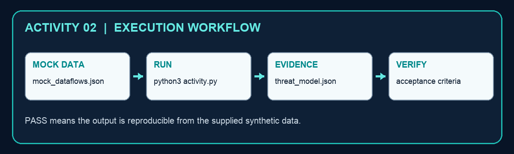

# Activity 02 — Threat-Model Agent Trust Boundaries

**Criteria:** A1  
**Duration:** 60–90 minutes  
**Mode:** Individual, offline simulation using synthetic data only

## Objective

Create `threat_model.json` from `mock_dataflows.json` and use the evidence to make a defensible security-operations decision.

## Files

- `activity.py` — runnable Python 3 script; standard library only.
- `mock_dataflows.json` — synthetic activity data; it contains no live credentials or personal data.
- `threat_model.json` — generated evidence artifact after the script runs.



## Procedure

1. Review the five trust zones and each flow in mock_dataflows.json.
2. Run python3 activity.py.
3. Inspect missing_controls and risk_score in threat_model.json.
4. Add a control to one weak boundary and rerun.
5. Confirm every accepted flow has authentication, authorisation, encryption and logging.

## Run

```bash
cd activity-02-trust-boundary-threat-model
python3 activity.py
```

## Verification

Every cross-zone flow has authentication, authorisation, encryption and logging controls.

The script must print `PASS`, the output file must exist, and the decision must reconcile with the supplied mock values.

## Troubleshooting

- `FileNotFoundError`: run the command from this activity folder and keep the mock-data filename unchanged.
- `JSONDecodeError`: restore valid JSON/JSONL syntax; JSONL requires one JSON object per line.
- CSV columns missing: restore the original header row before rerunning.
- Unexpected decision: compare the input value, policy threshold and rule in `activity.py`; do not edit the generated output by hand.

## Cleanup

Delete only the generated `threat_model.json` file, then rerun the script to recreate a clean evidence artifact. The mock data and script are source files and should be retained.
