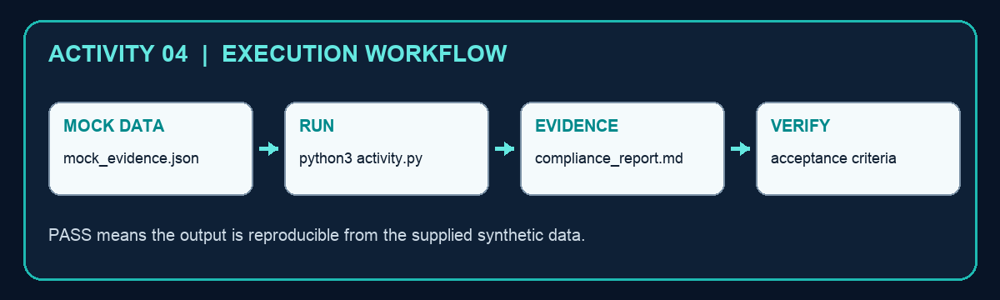

# Activity 04 — Assemble a Compliance Evidence Pack

**Criteria:** A3  
**Duration:** 60–90 minutes  
**Mode:** Individual, offline simulation using synthetic data only

## Objective

Create `compliance_report.md` from `mock_evidence.json` and use the evidence to make a defensible security-operations decision.

## Files

- `activity.py` — runnable Python 3 script; standard library only.
- `mock_evidence.json` — synthetic activity data; it contains no live credentials or personal data.
- `compliance_report.md` — generated evidence artifact after the script runs.



## Procedure

1. Read the requirements and evidence ages in mock_evidence.json.
2. Run python3 activity.py.
3. Open compliance_report.md and locate missing or stale evidence.
4. Assign a remediation owner and evidence due date.
5. Explain why a passing but stale artifact does not prove current operation.

## Run

```bash
cd activity-04-compliance-evidence
python3 activity.py
```

## Verification

Each required control maps to current evidence, an owner and a status; gaps are explicit.

The script must print `PASS`, the output file must exist, and the decision must reconcile with the supplied mock values.

## Troubleshooting

- `FileNotFoundError`: run the command from this activity folder and keep the mock-data filename unchanged.
- `JSONDecodeError`: restore valid JSON/JSONL syntax; JSONL requires one JSON object per line.
- CSV columns missing: restore the original header row before rerunning.
- Unexpected decision: compare the input value, policy threshold and rule in `activity.py`; do not edit the generated output by hand.

## Cleanup

Delete only the generated `compliance_report.md` file, then rerun the script to recreate a clean evidence artifact. The mock data and script are source files and should be retained.
