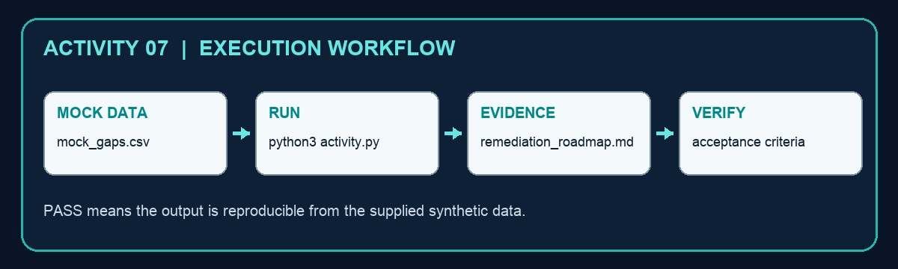

# Activity 07 — Prioritise a Security Gap Remediation Roadmap

**Criteria:** A6  
**Duration:** 60–90 minutes  
**Mode:** Individual, offline simulation using synthetic data only

## Objective

Create `remediation_roadmap.md` from `mock_gaps.csv` and use the evidence to make a defensible security-operations decision.

## Files

- `activity.py` — runnable Python 3 script; standard library only.
- `mock_gaps.csv` — synthetic activity data; it contains no live credentials or personal data.
- `remediation_roadmap.md` — generated evidence artifact after the script runs.



## Procedure

1. Review severity, risk reduction, cost, effort and dependency fields.
2. Run python3 activity.py.
3. Open remediation_roadmap.md and validate the SGD 40,000 constraint.
4. Challenge one ranking using feasibility or dependency evidence.
5. Define an acceptance test before considering a gap closed.

## Run

```bash
cd activity-07-gap-remediation
python3 activity.py
```

## Verification

The roadmap stays within the mock budget and prioritises overdue and above-appetite gaps.

The script must print `PASS`, the output file must exist, and the decision must reconcile with the supplied mock values.

## Troubleshooting

- `FileNotFoundError`: run the command from this activity folder and keep the mock-data filename unchanged.
- `JSONDecodeError`: restore valid JSON/JSONL syntax; JSONL requires one JSON object per line.
- CSV columns missing: restore the original header row before rerunning.
- Unexpected decision: compare the input value, policy threshold and rule in `activity.py`; do not edit the generated output by hand.

## Cleanup

Delete only the generated `remediation_roadmap.md` file, then rerun the script to recreate a clean evidence artifact. The mock data and script are source files and should be retained.
