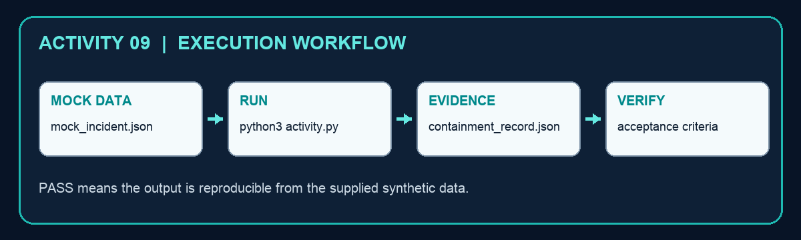

# Activity 09 — Contain a Prompt-Injection Incident

**Criteria:** A7  
**Duration:** 60–90 minutes  
**Mode:** Individual, offline simulation using synthetic data only

## Objective

Create `containment_record.json` from `mock_incident.json` and use the evidence to make a defensible security-operations decision.

## Files

- `activity.py` — runnable Python 3 script; standard library only.
- `mock_incident.json` — synthetic activity data; it contains no live credentials or personal data.
- `containment_record.json` — generated evidence artifact after the script runs.



## Procedure

1. Read the prompt-injection incident facts and proposed actions.
2. Run python3 activity.py.
3. Open containment_record.json and verify contain-first ordering.
4. Confirm disablement and token revocation precede investigation.
5. Identify the preserved trace needed for root-cause analysis.

## Run

```bash
cd activity-09-prompt-injection-response
python3 activity.py
```

## Verification

The record proves agent disablement, token revocation, egress block and evidence preservation in the correct order.

The script must print `PASS`, the output file must exist, and the decision must reconcile with the supplied mock values.

## Troubleshooting

- `FileNotFoundError`: run the command from this activity folder and keep the mock-data filename unchanged.
- `JSONDecodeError`: restore valid JSON/JSONL syntax; JSONL requires one JSON object per line.
- CSV columns missing: restore the original header row before rerunning.
- Unexpected decision: compare the input value, policy threshold and rule in `activity.py`; do not edit the generated output by hand.

## Cleanup

Delete only the generated `containment_record.json` file, then rerun the script to recreate a clean evidence artifact. The mock data and script are source files and should be retained.
